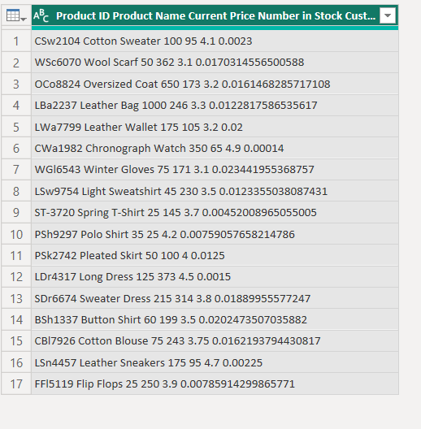
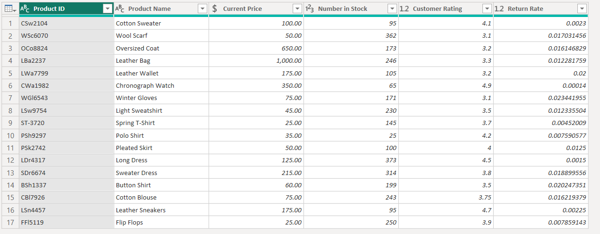
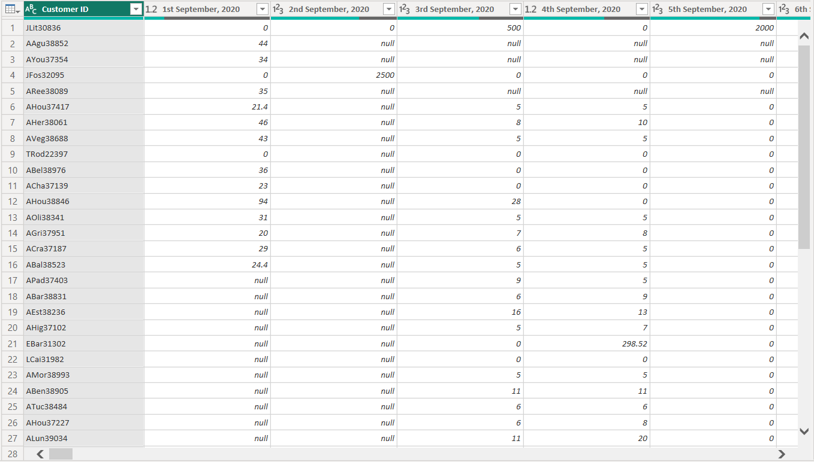
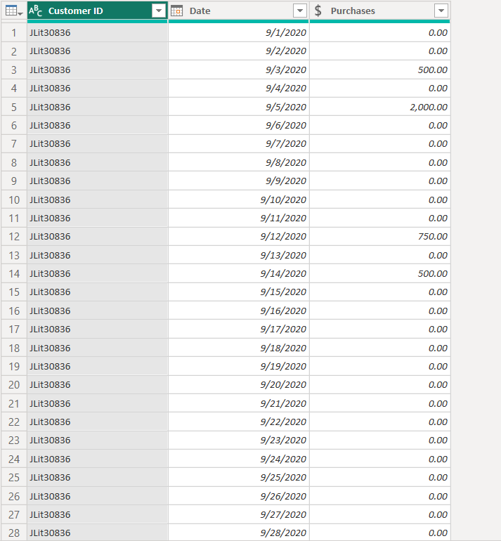
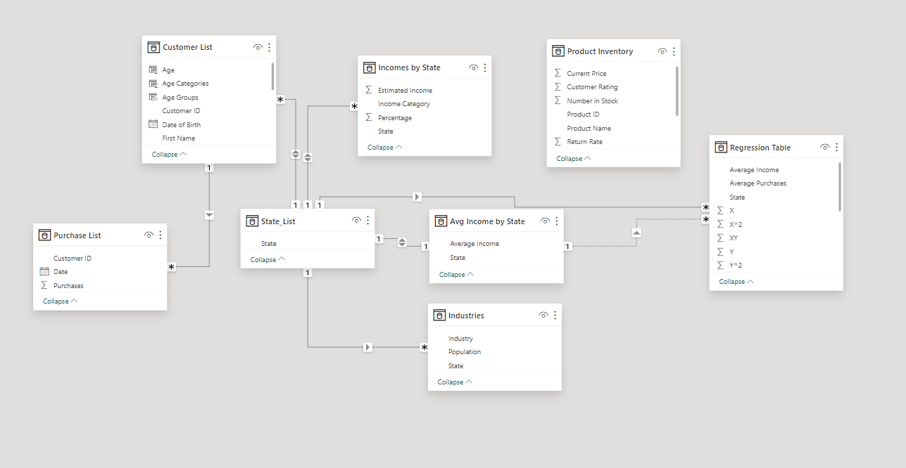
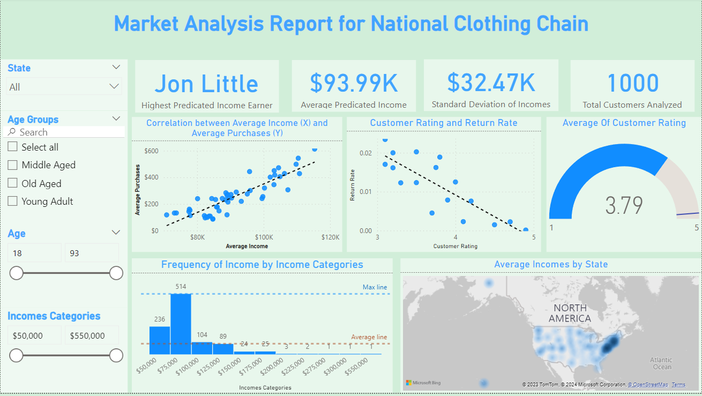
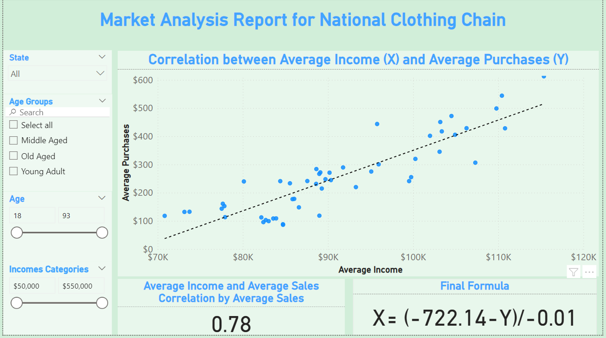
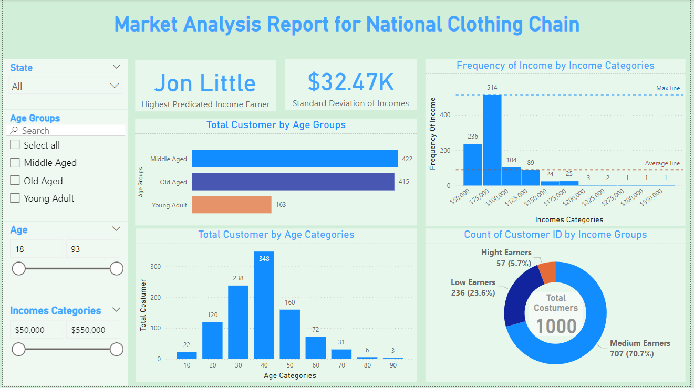
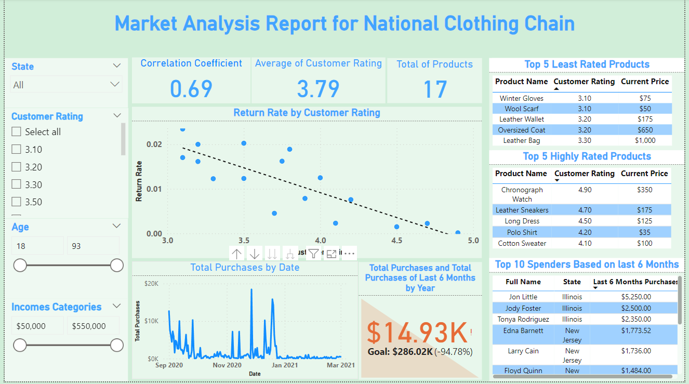
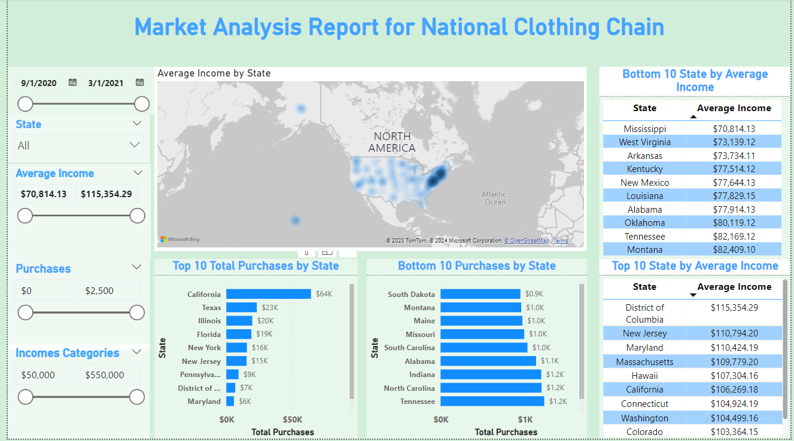

# Market-Analysis-Report-For-A-National-Clothing-Chain
## Introduction
 An online national clothing chain needs your help creating a targeted marketing campaign. Sales have been flat and they want to lure lost customers back. They want to advertise specific products to specific customers in specific locations, but they don’t know who to target. They have three products in mind:
  * Shirt: 25$
  * Sweater: 100$
  * Leather Bag: 1,000$
#### They need you to conduct an analysis to determine the best product to advertise to each customer.
## Project Instructions
In this project, you will use population statistics from the US Census Bureau to determine where the greatest income exists around the country and whether there is a correlation between sales and income. We don’t know the incomes of our customers, but we should be able to predict it by looking at their purchase history and locations and comparing that against the census data. Additionally, we want to analyze our inventory, specifically customer ratings and return rate and see if there’s a correlation between the two.
## Analysis Questions:
  1. What is the correlation (R2 value) between sales and income?
  2. What is the correlation (R2 value) between customer ratings and product return rate?
  3. What are the linear regression formulas to predict customer income from customer sales?
  4. Which customer do you predict has the highest income?
  5. Which product will be advertised the most?
## Data Sourcing
The project will use a variety of data sources, many of which were provided by Udacity and data on weather which will be sourced online.
### US Census Bureau
  * Average income
  * location
  * population
  * industry
### Business Data
  * Product inventory
  * Product prices
  * Customer rating
  * Product return rate
### Customer Data
  * Customer ID
  * Names
  * Location
  * Date of birth
  * Purchase history
## Data Transformation
### Product Inventory
| Before Cleaning	| After Cleaning	|
| ---	| --- |
|||
#### Power Query's split column by Delimiter function was used to split the single-column Product Inventory column into multiple columns, renamed these columns and changed their data types accordingly.
### Purchase History
| Before Cleaning	| After Cleaning	|
| ---	| --- |
|| |
#### Power Query's unpivot function was used to unpivot the multiple-date columns into two (Attributes and Values), renamed these columns and changed their data types accordingly.

## Data Modelling
A star schema was used by creating relationship between the necessary tables

## Analysis & Visualization
The report consists of five pages:
1. Summary
2. Average Income vs Average Sales
3. Customer Analysis
4. Product Analysis
5. Geographical Analysis
### Summary

The summary page provide an overview of the solutions to the business problems listed above. It contains visuals from the other four pages with each visual addressing a particular business problem.

### Average Income vs Average Sales
* There is a strong positive correlation between Average Income and Sales with a correlation coefficient of 0.78
* The regression formula: x = -722.14 – y / -m

### Customer Analysis
 * Jon Little is predicted to be the highest-income earner. This was achieved using the regression formula: x = -722.14 – y / -m
 * Standard Deviation of Incomes is 32.47K $
 * About 71% of customers are medium-income earners

### Product Analysis
 * There is a strong negative correlation between customer ratings and product return rate with a correlation coefficient of 0.69
 * Chronograph Watch is the best rated product with a rating of 4.90
 * Winter Gloves and Wool Scarf are the least rated products with a rating of 3.10
 * Based on customer transaction data from September 2020 to March 2021, 80% of top 10 customers (spenders) are from Illinois and New Jersey

### Geographical Analysis
 * District of Columbia, New Jersey, Maryland, Massachusetts, Hawaii, California, Connecticut, Washington, Colorado, and New Hampshire are the top 10 states based on average income while Mississippi, West Virginia, Arkansas, Kentucky, New Mexico, Louisiana, Alabama, Oklahoma, Tennessee and Montana are the bottom 10 states based on average income.
 * Texas, Illinois, Florida, New York, and New Jersey are the Top 5 most purchased states While South Dakota, Montana, Maine, Missouri, and South Carolina are the Bottom 5 most purchased states.

## Recommendation
 * Leather bag is one of the least rated products. For this reason, I suggest that among the three suggested products, Leather bags should be advertised the most. Again, it should be marketed in the higher-income states.
 * Shirts, in all have a favorable rating at a fairly good price. Of all the four different kinds of shirts, Polo Shirt is the best-rated product. These products could be marketed in almost all the states.
#### Thanks for reading and any note is welcome

